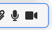

AHJ. Chaos Organizer
---

###### tags: `netology` `advanced js in html`

## Легенда

Мы всё больше привыкаем к неформальному формату организации информации, где ключевое - не структура, а удобство и поиск. Примеры - Slack, Telegram, WhatsApp, вплоть до помощников типа Siri или Алиса.

## Основная концепция

Ключевая идея - создать бота, который предназначен как для хранения информации, так и для поиска, и других сервисов: напоминания, уведомление и интеграция с внешними сервисами.

Назовём это глобальным ботом-органайзером - вы закидывате туда всю информацию, которая вам нужна, а он сортирует, обеспечивает поиск, хранение и напоминание.

## Архитектура

Серверная часть расположена на [Heroku](https://alex-m18-ahj-diploma.herokuapp.com/). Написана с использованием:
* [koa](https://koajs.com)
* [koa-static](https://github.com/koajs/static) (для отдачи клиенту мультимедиа и файлов)
* ws (через библиотеку [socket.io](https://github.com/socketio/socket.io))
* [lowdb](https://alex-m18.github.io/ahj-diploma/) (база данных)

Клиентская часть развернута на [github-pages](https://alex-m18.github.io/ahj-diploma/) через Appveyor. Использованы:
* [Webpack](https://webpack.js.org/)
* [Babel](https://github.com/babel/babel)
* [ESLint](https://eslint.org/)
* [Font-Awesome](https://fontawesome.com/icons?d=gallery)

## Функции

### Авторизация (дополнительная функция)
При первом открытии страницы будет предложено авторизоваться. Для этого нужно ввести своё имя и пароль и нажать кнопку `Войти` или клавишу `Enter`. Изначально доступен пользователь `demo` / `demo`.

### Регистрация (дополнительная функция)
Для регистрации нового пользователя достаточно ввести новое имя и придуманный пароль в окно авторизации и нажать кнопку `Зарегистрироваться` (см. рисунок выше). При успешной авторизации сразу произойдет вход. При возникновении ошибки авторизации, она будет показана пользователю.

Для выхода из аккаунта достаточно нажать кнопку `Выход` в верхнем правом углу приложения

### Синхронизация (дополнительная функция)
При входе в аккаунт одновременно с разных устройств происходит синхронизация при добавлении/изменении статусов постов.

### Сохранениие сессии (дополнительная функция)
При успешном входе авторизация на устройстве сохраняется в течение недели. При повторном входе срок действия авторизации соответственно продлевается.

### Сохранение в истории ссылок и текстовых сообщений (основная функция)
Для этого просто введите любой текст и/или ссылки в поле ввода в нижней части страницы и нажмите `Enter`.

### Ссылки (основная функция)
Ссылки (то, что начинается с `http://` или `https://`) после сохранения кликабельны и отображаются как ссылки (см. рисунок выше).

### Сохранение в истории изображений, видео и аудио (как файлов) (основная функция)
Для этого нажмите значок скрепки рядом с полем ввода (см. рисунок выше). Откроется стандартное окно выбора файлов. Выберите необходимый файл.

### Сохранение в истории файлов любого типа (дополнительная функция)
При выборе файла для заливки можно выбирать любые типы файлов. В ленте они будут отображаться, как на картинке:

### Сохранение в истории файлов с помощью Drag'n'Drop (основная функция)
Для сохранения сразу нескольких файлов, можно просто перетянуть их в приложение.

### Запись видео и аудио (дополнительная функция)
Для записи видео и аудио нужно нажать соответствующую пиктограмму рядом с полем ввода. Начнётся запись, будет отображаться таймер. При записи видео оно дублируется над полем ввода. Для остановки записи нужно нажать соответствующую пиктограмму слева от таймера. Справа от таймера находится кнопка отмены записи.

### Воспроизведение видео/аудио (дополнительная функция)
При сохранении аудио / видео в ленте отображаются соответствующие элементы управления для воспроизведения мультимедиа. Используется API браузера.

### Миниатюры изображении (дополнительная функция)
При сохранении изображении в ленте отображаются их миниатюры.

### Отправка геолокации (дополнительная функция)
При создании поста предлагается сохранить координаты. Если они недоступны, предлагается ввести их вручную. Если геолокация запрещена, предложение ввести координаты не появляется.
При нажатии на значок глазика происходит переход на карту.

### Скачивание файлов (основная функция)
Для скачивания файла достаточно кликнуть по его пиктограмме.
При клике на миниатюру, она открывается в полный размер, после чего её можно сохранить стандартными средствами браузера.
Для скачивания аудио / видео необходимо нажать соответствующий пункт в меню элемента  управления интересующего мультимедиа.

### Ленивая подгрузка (основная функция)
При обновлении страницы сначала подгружаются последние 10 сообщений, при прокрутке вверх подгружаются следующие 10 и т.д.

### Закрепление (pin) сообщений (дополнительная функция)
Для закрепления сообщения достаточно нажать на значок канцелярской кнопки в нужном сообщении. Закреплять можно только одно сообщение (прикрепляется к верхней части страницы):

### Поиск (дополнительная функция)
Для поиска определённого сообщения введите искомую строку поле поиска в верхней части приложения и нажмите `Enter`.

Поиск ведется:
* по тексту сообщений
* по именам сохраненных файлов и мультимедиа

Примеры: `hello`, `txt`, `file.xls`

Для сброса поиска очистите поисковую строку и нажмите `Enter`.

### Фильтр (дополнительная функция)
Подерживается фильтрация по типу содержания сообщений при поиске. Для использования необходимо написать строку фильтра в начале поисковой строки. Далее через пробел можно написать дополнительную строку поиска.

Например: `@pic`, `@file doc`

Доступны следующие фильтры:
* `@pic` - только сообщения с картинками
* `@audio` - только сообщения с аудио
* `@video`- только сообщения с видео
* `@file` - только сообщения с файлами
* `@text` - только текстовые сообщения
* `@fav` - только избранные сообщения (см.ниже)

### Избранное (дополнительная функция)
Для добавления сообщения в избранное достаточно нажать на звёздочку в нужном сообщении.
Для удаления из избранного достаточно нажать на неё ещё раз.
В избранных сообщениях значок звёздочки отображается и подсвечен постоянно.

Для отображения всех избранных сообщений введите `@fav` в поле поиска и нажмите `Enter`.

